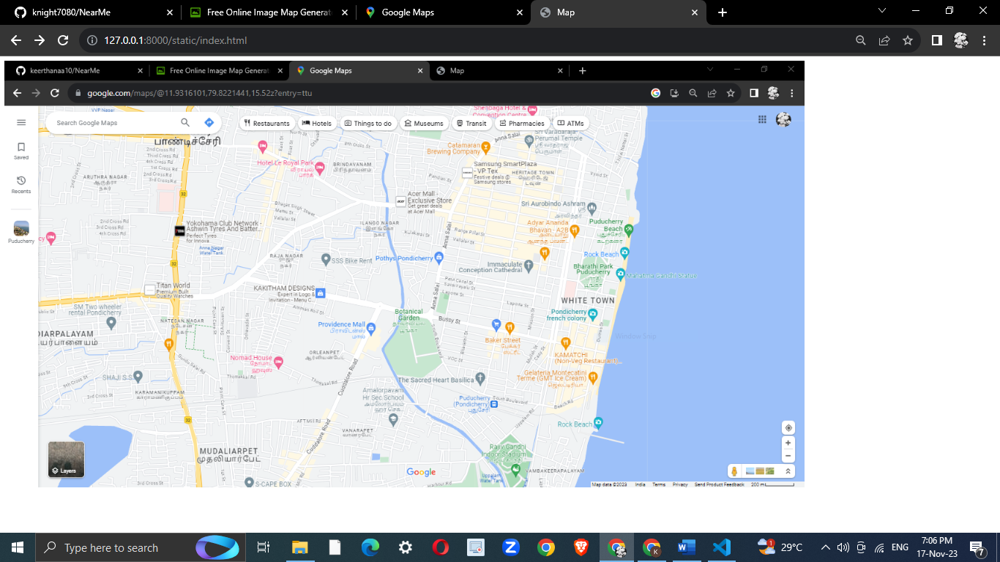
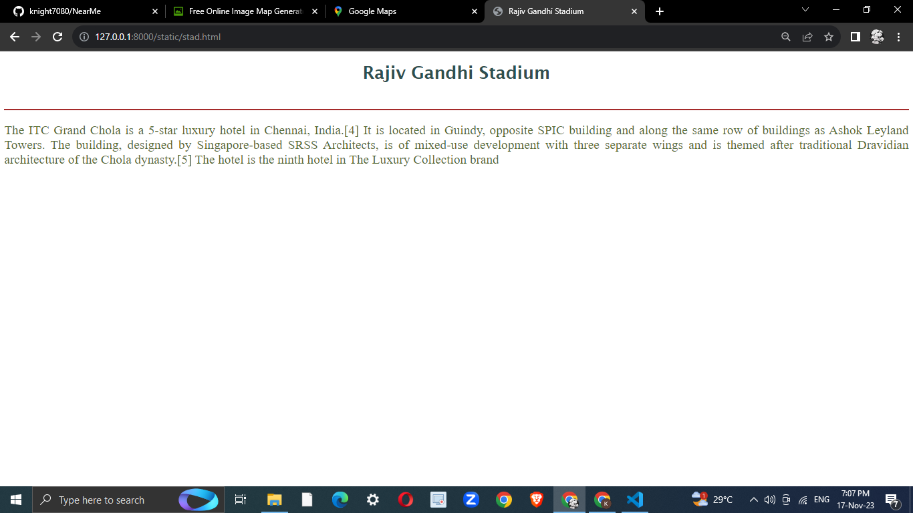
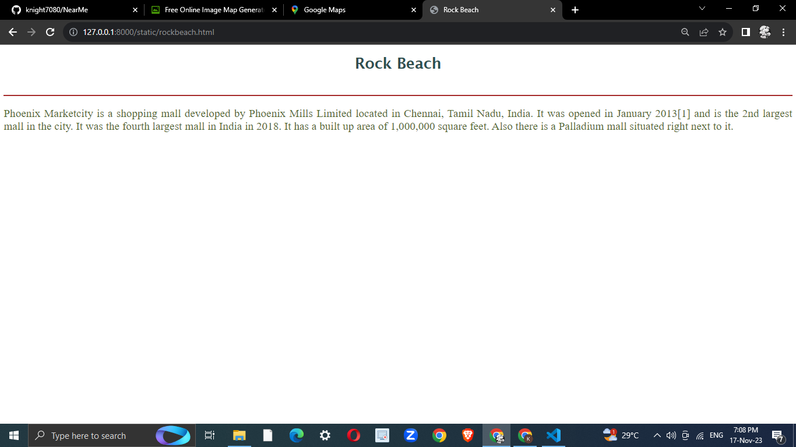
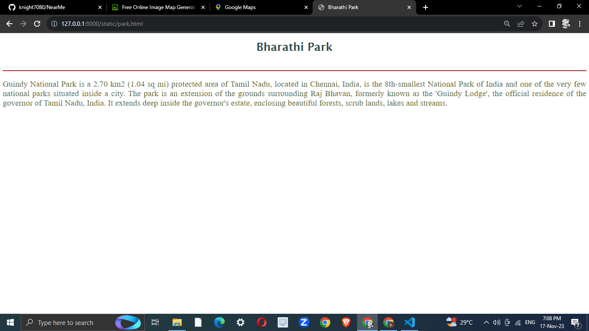
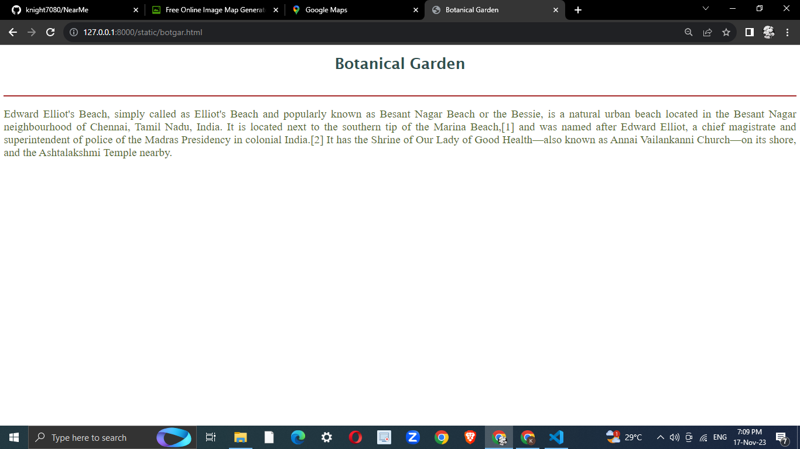
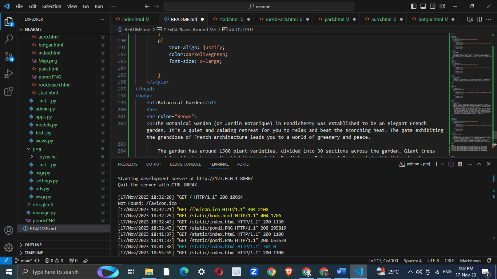

# Ex04 Places Around Me

Date : 17-10-2023

## AIM
To develop a website to display details about the places around my house.

## DESIGN STEPS

### STEP 1
Create a Django admin interface.

### STEP 2
Download your city map from Google.

### STEP 3
Using ```<map>``` tag name the map.

### STEP 4
Create clickable regions in the image using ```<area>``` tag.

### STEP 5
Write HTML programs for all the regions identified.

### STEP 6
Execute the programs and publish them.

## CODE

```html
<!DOCTYPE html>
<html lang="en">
<head>
    <meta charset="UTF-8">
    <meta name="viewport" content="width=device-width, initial-scale=1.0">
    <title>Map</title>
</head>
<body>
    

<map name="image-map">
    <area target="_parent" alt="Botanical Garden" title="Botanical Garden" href="botgar.html" coords="679,436,721,443,748,506,717,538,673,535,647,493" shape="poly">
    <area target="_parent" alt="Rock Beach" title="Rock Beach" href="rockbeach.html" coords="1066,268,1076,269,1060,362,1058,377,1054,396,1043,433,1036,460" shape="poly">
    <area target="_parent" alt="Rajiv Gandhi Stadium" title="Rajiv Gandhi Stadium" href="stad.html" coords="824,670,862,639,898,670,889,722,865,724,843,694" shape="poly">
    <area target="_parent" alt="Bharathi Park" title="Bharathi Park" href="park.html" coords="988,340,1008,328,1029,345,1024,378,1013,392,995,394,982,377" shape="poly">
    <area target="_parent" alt="Aurobindo Ashram" title="Aurobindo Ashram" href="auro.html" coords="988,251,1020,256,1013,273,985,267" shape="poly">
</map>
</body>
</html>
```

```html
<!DOCTYPE html>
<html lang="en">
<head>
    <meta charset="UTF-8">
    <meta name="viewport" content="width=device-width, initial-scale=1.0">
    <title>Rajiv Gandhi Stadium</title>
    <style>
        h1{
            text-align: center;
            font-family: 'Lucida Sans', 'Lucida Sans Regular', 'Lucida Grande', 'Lucida Sans Unicode', Geneva, Verdana, sans-serif;
            color:darkslategray;
        }
        p{
            text-align: justify;
            color:darkolivegreen;
            font-size: x-large;
            
        }
    </style>
</head>
<body>
    <h1>Rajiv Gandhi Stadium</h1>
    <br>
    <hr color="Brown">
    <p>Located next to the Indira Gandhi Sports Stadium, the Rajiv Gandhi Indoor Stadium is a haven for sports enthusiasts. At the center of the stadium is the basketball court, whereas, the court is surrounded by other facilities for volleyball, badminton and table tennis. Apart from events and competition of these sports, the stadium is also host to state and national-level events of sqay, judo and karate.</p>

</body>
</html>
```

```html
<!DOCTYPE html>
<html lang="en">
<head>
    <meta charset="UTF-8">
    <meta name="viewport" content="width=device-width, initial-scale=1.0">
    <title>Rock Beach</title>
    <style>
        h1{
            text-align: center;
            font-family: 'Lucida Sans', 'Lucida Sans Regular', 'Lucida Grande', 'Lucida Sans Unicode', Geneva, Verdana, sans-serif;
            color:darkslategray;
        }
        p{
            text-align: justify;
            color:darkolivegreen;
            font-size: x-large;
            
        }
    </style>
</head>
<body>
    <h1>Rock Beach</h1>
    <br>
    <hr color="Brown">
    <p>Pondicherry Beach known as "Rock Beach or Promenade Beach" is the popular stretch of beachfront in the city of Puducherry, India, along the Bay of Bengal. It is a 1.5 kilometre-long stretch in Pondicherry, starts from War Memorial built at the beginning of the beach and end at Dupleix Park on the Goubert Avenue.</p>
</body>
</html>
```

```html
<!DOCTYPE html>
<html lang="en">
<head>
    <meta charset="UTF-8">
    <meta name="viewport" content="width=device-width, initial-scale=1.0">
    <title>Bharathi Park</title>
    <style>
        h1{
            text-align: center;
            font-family: 'Lucida Sans', 'Lucida Sans Regular', 'Lucida Grande', 'Lucida Sans Unicode', Geneva, Verdana, sans-serif;
            color:darkslategray;
        }
        p{
            text-align: justify;
            color:darkolivegreen;
            font-size: x-large;
            
        }
    </style>
</head>
<body>
    <h1>Bharathi Park</h1>
    <br>
    <hr color="Brown">
    <p>Bharathi Park is a fantastic picnic site loved by locals and tourists alike. It is an ideal place to relax and unwind as you enjoy the green lawns and vibrant flower beds. The fine blend of historical and natural features makes Bharathi Park one of the best places to visit in Puducherry.</p>

</body>
</html>
```

```html
<!DOCTYPE html>
<html lang="en">
<head>
    <meta charset="UTF-8">
    <meta name="viewport" content="width=device-width, initial-scale=1.0">
    <title>Aurobindo Ashram</title>
    <style>
        h1{
            text-align: center;
            font-family: 'Lucida Sans', 'Lucida Sans Regular', 'Lucida Grande', 'Lucida Sans Unicode', Geneva, Verdana, sans-serif;
            color:darkslategray;
        }
        p{
            text-align: justify;
            color:darkolivegreen;
            font-size: x-large;
            
        }
    </style>
</head>
<body>
    <h1>Aurobindo Ashram</h1>
    <br>
    <hr color="Brown">
    <p>The Ashram is located in the eastern part of Pondicherry. Inmates live and work in a number of buildings spread throughout the area. The focus of community life is the Ashram main building, usually called simply "the Ashram", which consists of an interconnected block of houses, including those in which Sri Aurobindo and the Mother lived for most of their lives. At its centre, in a tree-shaded courtyard, lies the Samadhi, a white marble shrine where their bodies are laid to rest.

        The Ashram provides its members with all they need for a decent and healthy life. Various departments look after the basic requirements of food, clothing and shelter, as well as medical care. There are also libraries for study and facilities for a variety of cultural pursuits including music, dance, theatre, and the arts. Members regularly participate in physical education activities such as sports, asanas, strength training, and swimming. They are under the ownership of the Ministry of Education of the Government of India and are governed by the Institutes of Technology Act, 1961. The Act declares them as Institutes of National Importance and lays down their powers, duties, and framework for governance as the country's premier institutions in the field of technology.</p>

</body>
</html>
```

```html
<!DOCTYPE html>
<html lang="en">
<head>
    <meta charset="UTF-8">
    <meta name="viewport" content="width=device-width, initial-scale=1.0">
    <title>Botanical Garden</title>
    <style>
        h1{
            text-align: center;
            font-family: 'Lucida Sans', 'Lucida Sans Regular', 'Lucida Grande', 'Lucida Sans Unicode', Geneva, Verdana, sans-serif;
            color:darkslategray;
        }
        p{
            text-align: justify;
            color:darkolivegreen;
            font-size: x-large;
            
        }
    </style>
</head>
<body>
    <h1>Botanical Garden</h1>
    <br>
    <hr color="Brown">
    <p>The Botanical Garden (or Jardin Botanique) in Pondicherry was established to be an elegant French garden. It’s a quiet and calming retreat for you to relax and beat the scorching heat. The gate exhibiting the grandiose of French architecture leads you to a world of greenery and peace.

        The garden has around 1500 plant varieties, divided into 30 sections across the garden. Giant trees and fossil plants are the highlights of the Pondicherry Botanical Garden. And with this mix of endangered and exotic plant species, Botanical Garden of Pondicherry is a haven for nature lovers.</p>

</body>
</html>
```

## OUTPUT










## RESULT
The program for implementing image maps using HTML is executed successfully.
